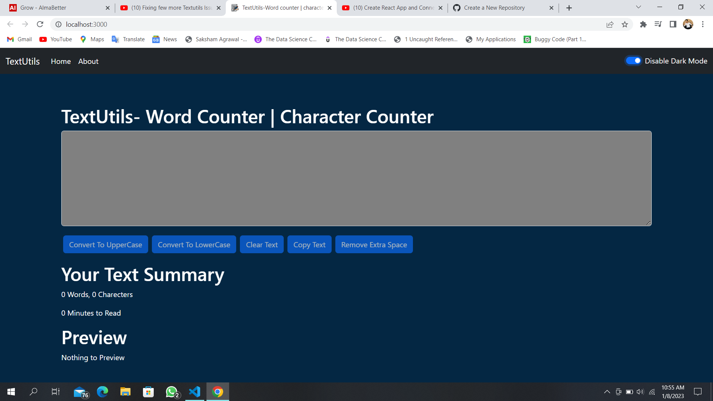
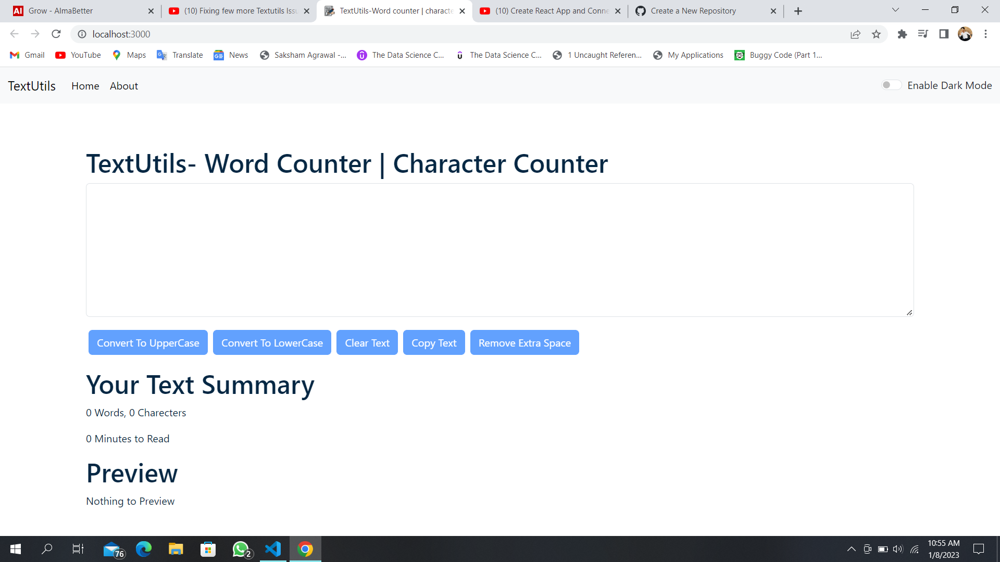

# THIS is My Project using React.js

My project name is TextUtils which is made using React.js and BootStrap and the component were made using Function base component.

## About this Project
>Textutils gives you a way to analyze your text quickly and efficiently, Be it word count, character count or time to read

>Textutils is a free character counter tool that provides instant character count & word count statics for a given text. Textutils reports the number of words and characters. Thus it is suitable for writing text with word/character limit.

>This word counter software work in any web Browser such as chrome, firefox, internet Explorer, safari,opera. it suits to count characters in facebook, blog, books, excel document, pdf document, essays etc.

# Here some Images on Webpage

